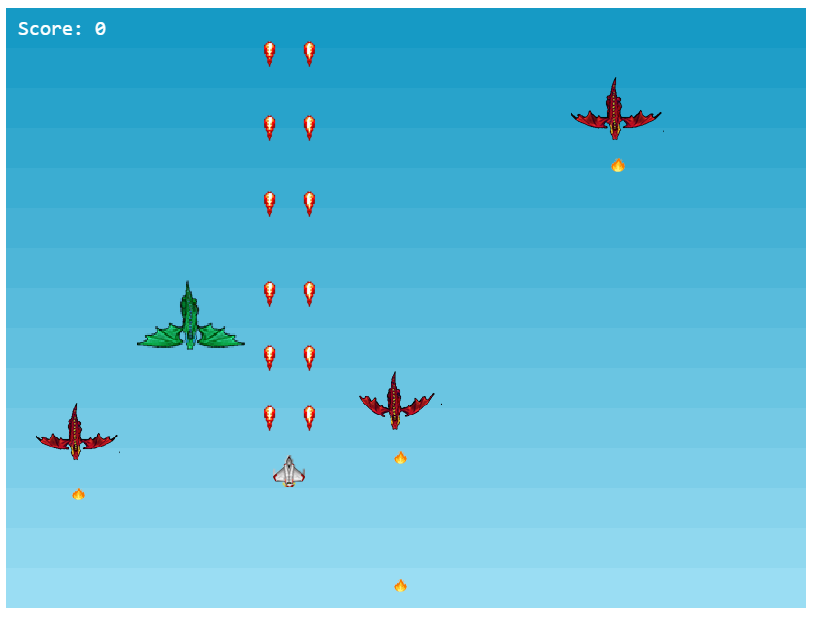
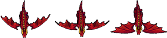
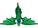
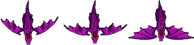

# DRAGON FIGHTER
 A Simple shooter game built with the Phaser Library.

## Built With
- Phaser
- JavaScript
- Webpack
- HTML
- Jest

## Live Link

[Live Demo Link](https://raw.githack.com/Samitti/Shooter-game/milestone_4/dist/index.html)

## Game Design
The Game Scene is built so that a player shoots at flying dragons and destroy as many as possible before they fire the player or colide with the player.

- There are three types of enemy dragons 

- The red dragons, which are very dangerous and give you higher score if you destroy them

 

- The green and the puple ones which are less dangerous than the red ones and give you less score than the red ones if you destroy them. 

- There is one fully armed fighter jet for the player that can destroy any dragon. 

  

## Getting Started
To get a copy up and running follow these simple example steps:-
- Clone `https://github.com/Samitti/Shooter-game` to your local machine.
- cd into the Shooter-game directory
- Run `npm install` to install dependancies.
- Run `npm start` to run the game in `http://localhost:8080/`.

## Author

👤 **Samuel Teweldebrhan Ghebremeskel**

- Github: [@githubhandle](https://github.com/Samitti)
- Twitter: [@twitterhandle](https://twitter.com/Samuel63734232)
- Linkedin: [linkedin](https://www.linkedin.com/in/samuel-ghebremeskel-29685811a/)

## 🤝 Contributing

Contributions, issues and feature requests are welcome!

Feel free to check the [issues page](https://github.com/Samitti/Shooter-game/issues).

## Show your support

Give a ⭐️ if you like this project!

